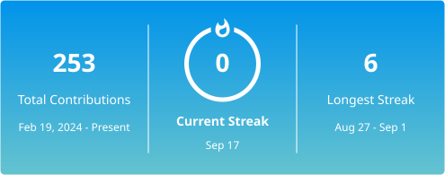

# Hi 👋 I'm Nnek

### Computer Science Undergraduate • Full-Stack Developer

<h4 align="center">Coffee sa umaga, Code sa gabi. Minsan Sabay</h4>

 

## 🌐 Connect with Me

  

 

## 💻 Tech Stack

  
   
  
  &nbsp;
  

 

  

 

## 💬 Quote

> *"Any technological or managerial scheme to force documentation can be subverted by unwilling programmers."*
>
> 
— Daniel T. Barry

